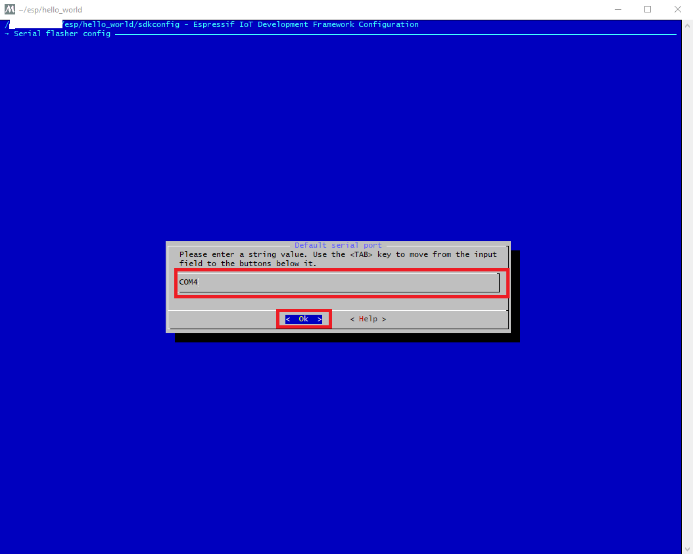

# ESP32 Development Guide: Windows Platform
Here is the steps on ESP32 guide developing on Windows.

## Setup Environment
* Download the [Toolchain](https://dl.espressif.com/dl/esp32_win32_msys2_environment_and_toolchain-20181001.zip) and then unzip it to `C:\`.


* Set the environment variable IDF_PATH.
  * The user profile scripts are contained in `C:/msys32/etc/profile.d/` directory.
  * Create a new script file in C:/msys32/etc/profile.d/ directory. Name it `export_idf_path.sh`.
  
  ** Identify the path to ESP-IDF directory. It is specific to your system configuration and may look something like 'C:\msys32\home\user-name\esp\esp-idf'.
  * Add the export command to the script file, refer to the following case.
    ```
    export IDF_PATH="C:/msys32/home/user-name/esp/esp-idf"
    ```
* Open the mingw32.exe.
  ```
  Note: 
  This is very important. Please refer to the following steps.  
  ```
  * Open `C:\msys32\mingw32.exe`, not `msys2.exe`. Otherwise it will prompt python command cann't be found.
  
  * Configuration (Compliling & Serial Port).
  
  * Navigate to `Serial flasher config -> Default serial port`.
  
   When serial port is configured.
  
  ```
  Note:
  On how to get the specific serial port. Open the Device Manager -> Ports.
  ```
  
  * Save the configuration.
  
  
  
  
